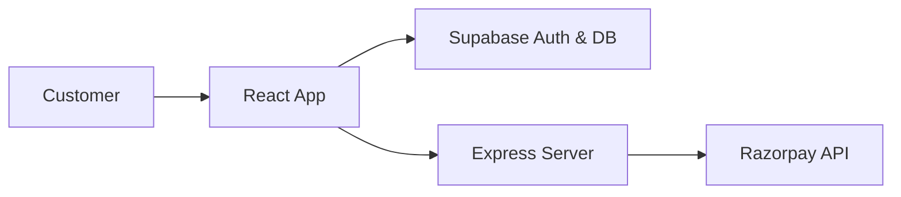

# 🚀 UNDERGROUNDZ

> A premium e-commerce and lifestyle platform with 3D elements and Razorpay integration.

### 🌐 Live Demo
[🚀 OPEN LIVE DEMO →](https://undergroundz.vercel.app) | [💻 Source Code](https://github.com/YUVA-2329/UNDERGROUNDZ) 

---

## 🎬 Demo & 📸 Screenshots


*(Project preview and screenshots demonstrating the core user experience)*

---

## 🧠 About the Project

This project was built to solve real-world challenges through modern web technologies and advanced engineering. By combining scalable architecture with an intuitive user interface, UNDERGROUNDZ provides an exceptional user experience while maintaining high performance and security.

### ✨ Key Features
- 🛍️ Full-featured e-commerce flow
- 💳 Razorpay payment gateway integration
- 🧊 Interactive 3D elements using Three.js
- 🔐 Secure authentication via Supabase
- 🎨 High-end visual identity and animations

---

## 🛠️ Tech Stack

**Frontend:** React, TypeScript, Tailwind CSS, Three.js, Framer Motion
**Backend:** Node.js, Express, Supabase
**Payments:** Razorpay

---

## 🏗️ Architecture



---

## ⚙️ How It Works

1. Users browse products in a visually immersive 3D-enhanced environment.
2. Products are added to the cart and state is managed globally.
3. Upon checkout, a payment intent is created via the backend using Razorpay.
4. Transaction success is recorded in the Supabase database.

---

## 🚀 Getting Started

### Installation

```bash
git clone https://github.com/YUVA-2329/UNDERGROUNDZ.git
cd undergroundz
npm install
npm run dev
```

### Environment Variables
Create a `.env` file in the root directory:
```env
SUPABASE_URL=YOUR_SUPABASE_URL
SUPABASE_ANON_KEY=YOUR_ANON_KEY
RAZORPAY_KEY_ID=YOUR_RAZORPAY_KEY
```

---

## 📁 Project Structure

```text
project/
├── src/
│   ├── components/
│   ├── pages/
│   └── store/
├── server.ts
└── package.json
```

---

## 🛣️ Roadmap

- [x] UI/UX Design
- [x] Payment Gateway Integration
- [x] Database Schema
- [ ] User Order History
- [ ] Admin Dashboard

---

## 📊 Status

🟢 Production Ready

---

## 👨‍💻 Author

**Yuva Kishore Peta**  
GitHub: [YUVA-2329](https://github.com/YUVA-2329)
